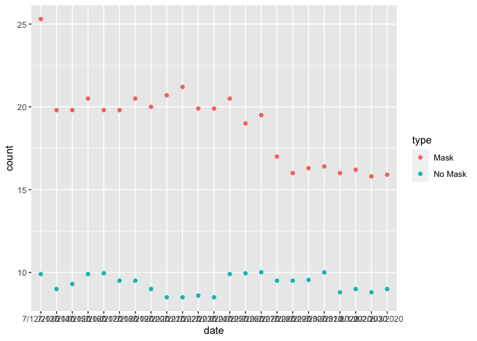

Lab 07 - Conveying the right message through visualisation
================
Heather Hawkins
03/30/23

### Load packages and data

``` r
library(tidyverse) 
```

### Exercise 1

This visualization is misleading because there are TWO DIFFERENT types
of scales. Masked mandated counties are scaled from 15-25 while no-mask
mandated counties counts are scaled from 4-14. If you DEEPLY look at
this data, no-mask county counts are VERY low 😡😡😡

``` r
df1 <- data.frame(id = c(1,2),
                  name = c('MASK','Nomask'))
MASK_data <- tribble(
  ~type, ~date, ~count,
  "Mask", "7/12/2020", 25.3,
  "Mask", "7/13/2020", 19.8,
  "Mask", "7/14/2020", 19.8,
  "Mask", "7/15/2020", 20.5,
  "Mask", "7/16/2020", 19.8,
  "Mask", "7/17/2020", 19.8,
  "Mask", "7/18/2020", 20.5,
  "Mask", "7/19/2020", 20,
  "Mask", "7/20/2020", 20.7,
  "Mask", "7/21/2020", 21.2,
  "Mask", "7/22/2020", 19.9,
  "Mask", "7/23/2020", 19.9,
  "Mask", "7/24/2020", 20.5,
  "Mask", "7/25/2020", 19,
  "Mask", "7/26/2020", 19.5,
  "Mask", "7/27/2020", 17,
  "Mask", "7/28/2020", 16,
  "Mask", "7/29/2020", 16.3,
  "Mask", "7/30/2020", 16.4,
  "Mask", "7/31/2020", 16,
  "Mask", "8/1/2020", 16.2,
  "Mask", "8/2/2020", 15.8,
  "Mask", "8/3/2020", 15.9,
  "No Mask", "7/12/2020", 9.9,
  "No Mask", "7/13/2020", 9,
  "No Mask", "7/14/2020", 9.3,
  "No Mask", "7/15/2020", 9.9,
  "No Mask", "7/16/2020", 9.95,
  "No Mask", "7/17/2020", 9.5,
  "No Mask", "7/18/2020", 9.5,
  "No Mask", "7/19/2020", 9,
  "No Mask", "7/20/2020", 8.5,
  "No Mask", "7/21/2020", 8.5,
  "No Mask", "7/22/2020", 8.6,
  "No Mask", "7/23/2020", 8.5,
  "No Mask", "7/24/2020", 9.9,
  "No Mask", "7/25/2020", 9.95,
  "No Mask", "7/26/2020", 10.01,
  "No Mask", "7/27/2020", 9.5,
  "No Mask", "7/28/2020", 9.5,
  "No Mask", "7/29/2020", 9.55,
  "No Mask", "7/30/2020", 10,
  "No Mask", "7/31/2020", 8.8,
  "No Mask", "8/1/2020", 9,
  "No Mask", "8/2/2020", 8.8,
  "No Mask", "8/3/2020", 9,
)
```

Because of this, I ACTUALLY counted these counts of covid-19 for each
type of county.

### Exercise 2

``` r
MASK_data %>%
ggplot(mapping = aes(x = date,
                  y = count, 
                  color= type)) +
  geom_point()
```

<!-- -->

### Exercise 3

As you can see, reformatting the scale to fit both types and adding the
true numbers shoe that counties with no-mask mandates actually had LESS
cases of COVID-19 than counties with mask mandates.

### Exercise 4

What, if any, useful information do these data and your visualization
tell us about mask wearing and COVID? It’ll be difficult to set aside
what you already know about mask wearing, but you should try to focus
only on what this visualization tells. Feel free to also comment on
whether that lines up with what you know about mask wearing.

…
